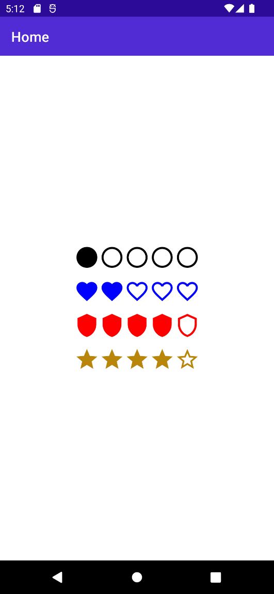
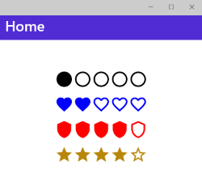

# Simple Rating Control for .NET MAUI

A Simple Rating Control for .NET MAUI using an icon font.

<br/>

## Screenshots

### Android 



### Windows 



<br/>

## Setup

Available on NuGet: [SimpleRatingControl.MAUI](https://www.nuget.org/packages/SimpleRatingControl.MAUI)

[](https://www.nuget.org/packages/SimpleRatingControl.MAUI)

Just add the package to your .NET MAUI application.

<br/>

## API Usage

Initialize the package by calling `UseSimpleRatingControl()` on `MauiProgram`:
```CSHARP
var builder = MauiApp.CreateBuilder();

builder
	.UseMauiApp<App>()
	.UseSimpleRatingControl()

    // other configurations

return builder.Build();
```

You must add this namespace to your `xaml` files:

```XML
xmlns:controls="http://www.tsjdev-apps.de/maui/controls"
```

Now you can use the `SimpleRatingControl` from this namespace:
```XML
<controls:SimpleRatingControl Amount="5"
                              CurrentValue="1"
                              AccentColor="Black"
                              StarSize="36"
                              RatingType="Circle" />
```

<br/>

## Available Properties

| Property       | Type          | Description                                              | Default Value |
|----------------|---------------|----------------------------------------------------------|---------------|
| `CurrentValue` | `double`      | Sets the value which should be used as the rating.       | `0`           |
| `Amount`       | `double`      | Sets the amount of the maximum amount of possible stars. | `10`          |
| `StarSize`     | `double`      | Sets the size of each star.                              | `24`          |
| `AccentColor`  | `Color`       | Sets the color of the stars.                             | `Red`         |
| `RatingType`   | `RatingType`  | Sets the type of the icon which should be used.          | `Star`        |